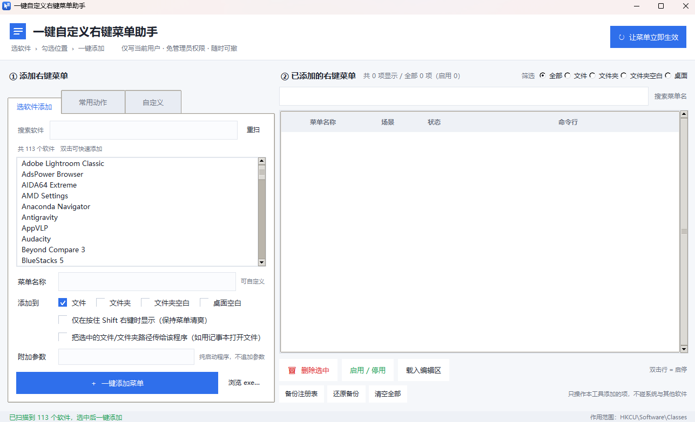
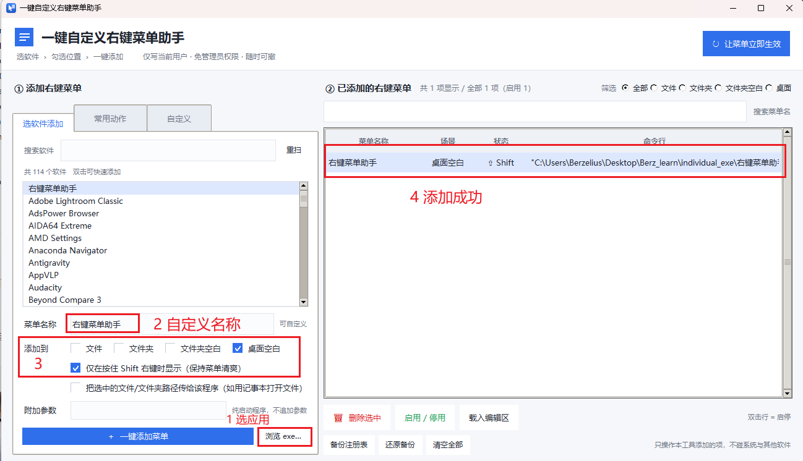
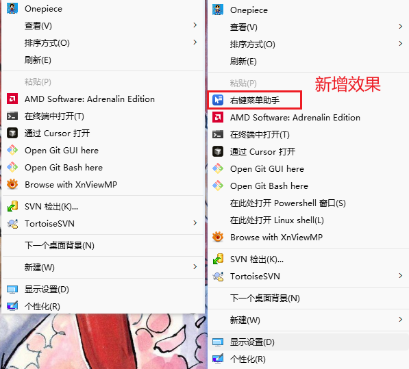

# 右键菜单助手 · CtxMenu Assistant

> 把你常用的软件一键加到 Windows 右键菜单里。想删就删，不用碰注册表。

<p align="center">
  <b>选软件 › 勾选位置 › 一键添加</b>
</p>

<p align="center">
  <a href="https://github.com/bezerlius/ctxmenu-assistant-berz/releases"></a>
  <a href="LICENSE"></a>
  <a href="https://www.python.org/downloads/"></a>
  
</p>

---

## 界面展示

### ① 主界面 —— 打开就能用

程序启动后自动扫描本机已安装的软件（实测扫出 **113 个**），
左边是软件列表 + 添加配置区，右边是所有已添加菜单的清单。

> 下图为**全新打开、尚未添加任何菜单**的状态，右上角显示「共 0 项显示」。



界面分成两个面板：

| 区域 | 作用 |
|------|------|
| **左栏 · 添加右键菜单** | 三种添加方式：「选软件添加」/「常用动作」/「自定义」三个页签 |
| **右栏 · 已添加的右键菜单** | 列出全部自建项，可筛选、搜索、删除、启停、载入编辑 |

### ② 添加一个菜单 —— 四步搞定

以「把本工具自己也加进桌面右键菜单」为例，用红框标注了完整流程：

| 步骤 | 操作 |
|:---:|---|
| **1** | 点「**浏览 exe...**」选择程序（也可直接从上面的软件列表双击） |
| **2** | 填「**菜单名称**」，默认自动填入程序名，可随意改成喜欢的文字 |
| **3** | 勾选「**添加到**」的位置 —— 文件 / 文件夹 / 文件夹空白 / 桌面空白，可多选 |
| **4** | 点「**＋ 一键添加菜单**」，右侧清单立即出现新项 |

图中还同时演示了两个可选开关：勾了「**仅在按住 Shift 右键时显示**」（状态列会标 `⇧ Shift`），
以及多场景多选（同时勾了「文件夹空白」和「桌面空白」）。



### ③ 实际效果 —— 右键菜单里的样子

添加完成后点右上角「**↻ 让菜单立即生效**」，在桌面空白处右键即可看到，
新菜单项（红色框出）就排在 Windows 自带项的前面。

> 左图为添加前，右图为添加后 —— 对比一目了然。



---

## 它解决什么问题

想把 `VS Code`、`Windows Terminal`、`复制完整路径` 加进右键菜单，网上的教程都让你手改注册表 —— 步骤多、容易写错、删不干净。

这个工具把这些都包成**一个窗口、三次点击**：

```
① 选软件  →  ② 勾选位置  →  ③ 点「一键添加菜单」
```

- ✅ **不用管理员权限** —— 只写当前用户（HKCU）
- ✅ **随时可撤** —— 每一项都能一键删除，也能一键清空
- ✅ **不误伤系统** —— 只在列表里显示自己创建的项，绝不碰系统和其他软件的菜单
- ✅ **零第三方依赖** —— `.lnk` 解析、ICO 生成、单实例检测全部纯 Python/ctypes 实现

## 功能

| 功能 | 说明 |
|------|------|
| **选软件添加** | 自动扫描开始菜单和安装目录（实测可扫出 80+ 个应用），搜索框快速定位 |
| **四种右键场景** | 文件 / 文件夹 / 文件夹空白处 / 桌面空白处，可多选一次添加 |
| **自定义菜单名** | 自动填好程序名，随意改成你喜欢的文字 |
| **一键删除** | 选中即删；也可「停用」暂时隐藏（配置保留，随时开回来） |
| **Shift 隐藏** | 勾选后该菜单只在按住 `Shift` 右键时出现，保持菜单清爽 |
| **常用动作** | 内置「复制完整路径」「在此处打开 CMD/PowerShell」「用 VS Code 打开」等模板 |
| **自定义命令** | 自己写命令行，支持 `%1`（选中项路径）、`%V`（当前目录） |
| **备份 / 还原** | 导出成 `.reg` 文件，随时回滚 |
| **单实例守卫** | 重复启动不会开一堆窗口，而是激活已有窗口 |

## 下载使用

**方式一（推荐）**：直接下载仓库里的 exe
👉 [`dist/右键菜单助手.exe`](https://github.com/bezerlius/ctxmenu-assistant-berz/raw/main/dist/%E5%8F%B3%E9%94%AE%E8%8F%9C%E5%8D%95%E5%8A%A9%E6%89%8B.exe)

**方式二**：从 [Releases](https://github.com/bezerlius/ctxmenu-assistant-berz/releases) 页面下载

双击即用，**无需安装 Python**。

> 单文件 exe，约 10.5 MB。首次运行会稍慢（需要解压自身），属正常现象。

## 快速上手

1. 打开 `右键菜单助手.exe`
2. 左侧「**选软件添加**」页签里找到你要的软件（可搜索）
3. 填**菜单名称**（可自定义）
4. 勾选**添加到**哪些位置
5. 点 **「＋ 一键添加菜单」**
6. 点右上角 **「↻ 让菜单立即生效」**

详细说明见 [使用说明.md](使用说明.md)。

## 从源码运行

```bash
# 需要 Python 3.10+（且解释器带 tkinter）
python ctxmenu_gui.py
```

> ⚠️ 注意：部分精简版 Python 发行包**不含 tkinter**。可用
> `python -c "import tkinter; tkinter.Tk()"` 自检。

## 自行打包

```bash
pip install pyinstaller
打包.bat          # Windows 一键打包
```

或手动执行：

```bash
python -m PyInstaller --noconfirm --clean --onefile --windowed \
  --name "右键菜单助手" --icon app.ico --add-data "app.ico;." \
  --exclude-module numpy --exclude-module scipy --exclude-module PIL \
  ctxmenu_gui.py
```

## 项目结构

```
ctxmenu-assistant/
├── ctxmenu_core.py        # 注册表核心：增删改查、启停、备份还原
├── ctxmenu_apps.py        # 应用扫描：开始菜单/安装目录，纯 Python 解析 .lnk
├── ctxmenu_single.py      # 单实例守卫：重复启动时激活已有窗口
├── ctxmenu_gui.py         # 图形界面（tkinter）
├── make_icon.py           # 生成 app.ico（纯 Python 手写 ICO，不依赖 PIL）
├── 打包.bat                # 一键打包脚本
├── 使用说明.md              # 详细使用文档
├── dist/
│   └── 右键菜单助手.exe      # 打包成品
└── 测试/
    ├── _selftest.py       # 注册表层测试（26 项）
    ├── _guitest.py        # 界面层测试（29 项）
    ├── _shift_test.py     # Shift 隐藏功能测试（15 项）
    ├── _verify_single2.py # 单实例守卫验证
    ├── _screengrab.py     # 纯 ctypes GDI32 截图工具
    └── _shot_demo.py      # 界面演示/截图用启动器
```

## 技术要点

<details>
<summary>四种右键场景的注册表位置（点击展开）</summary>

| 场景 | 注册表路径（`HKCU\` 之下） | 传参变量 |
|------|---------------------------|---------|
| 右键**文件** | `Software\Classes\*\shell\<name>` | `%1` |
| 右键**文件夹** | `Software\Classes\Directory\shell\<name>` | `%1` |
| 右键**文件夹空白处** | `Software\Classes\Directory\Background\shell\<name>` | `%V` |
| 右键**桌面空白处** | `Software\Classes\DesktopBackground\shell\<name>` | `%V` |

每个菜单项写 `MUIVerb`（显示文字）、`Icon`、`command`（默认值=命令行），
以及 `_owner = ctxmenu-assistant` 作为**安全标记** —— 只管理带此标记的项。

</details>

<details>
<summary>踩过的坑（供开发者参考）</summary>

1. **不要调 `reg.exe`** —— 沙箱环境常把它列入黑名单。用 `winreg` 递归读写子树更稳。
2. **逻辑键名与真实键名必须分离** —— 停用功能靠给键名加 `_disabled_` 前缀实现，
   若只存逻辑名，重新启用时会拼出 `_disabled__xxx`（双下划线）导致查找失败。
3. **tkinter `clam` 主题的复选框画的是 ✗** —— 看上去像"错误/禁用"，
   所以用 Canvas 自绘了 `CheckChip`，保证是 ✓。
4. **单实例窗口遮挡** —— 没有单实例守卫时，重复启动的新窗口会被旧窗口挡住，
   用户感知为"点了没反应"。这是右键菜单类工具的头号陷阱。
5. **不要给 GUI 程序追加 `%V`** —— 计算器、QQ 这类程序不处理文件参数，硬塞是脏输入。

</details>

## 安全说明

- 所有改动都在 `HKCU\Software\Classes` 下，**只影响当前登录用户**
- 本工具创建的每一项都带 `_owner` 标记，列表中**只显示自己创建的项**
- 提供完整的**备份 / 还原 / 清空**能力，改动前建议先备份
- 源码完全公开，可自行审计

## 测试

```bash
python 测试/_selftest.py      # 注册表层，26 项
python 测试/_guitest.py       # 界面层，29 项
python 测试/_shift_test.py    # Shift 隐藏，15 项
```

共 70 项，覆盖增删改查、启停往返、备份还原、筛选搜索、
边界场景（不误删系统菜单）、Shift 属性写入与回填。

## License

[MIT](LICENSE)

---

*🐱 Made with care.*
